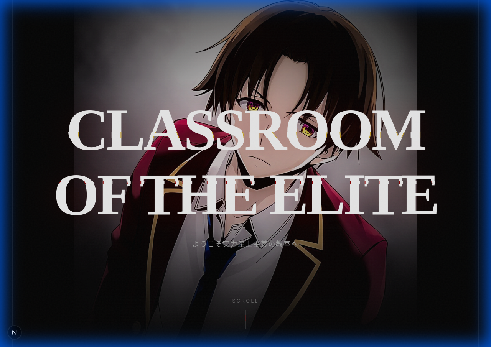
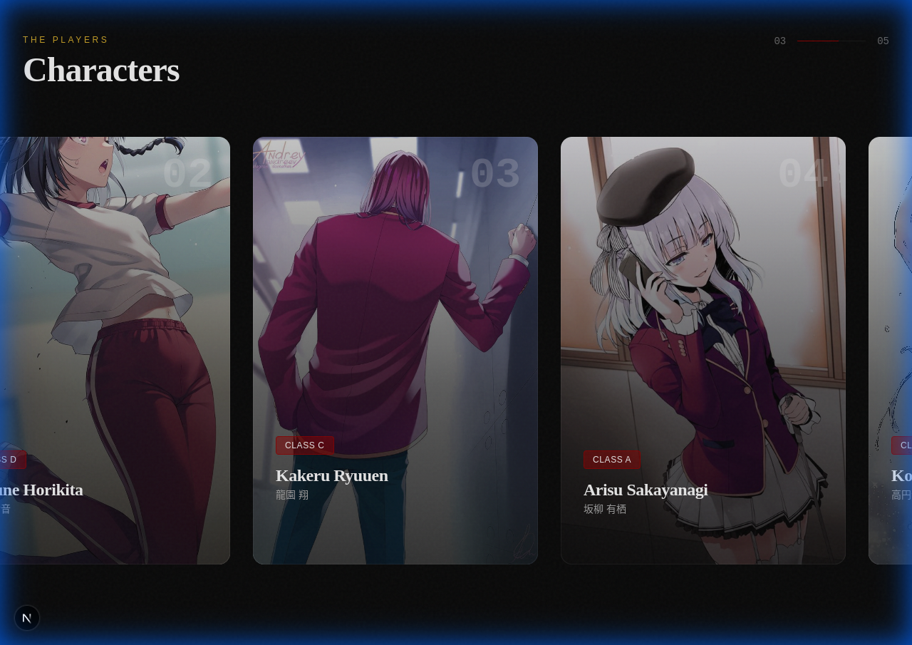
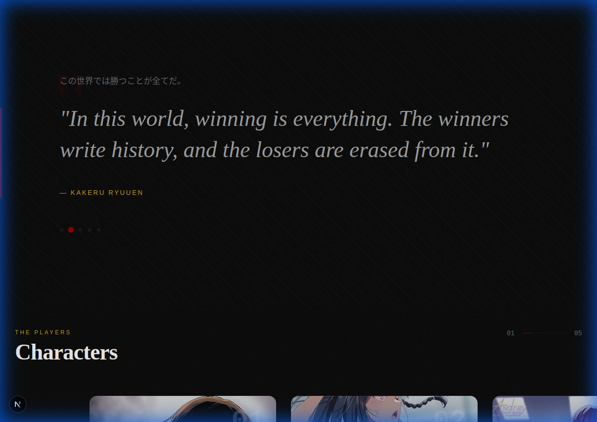
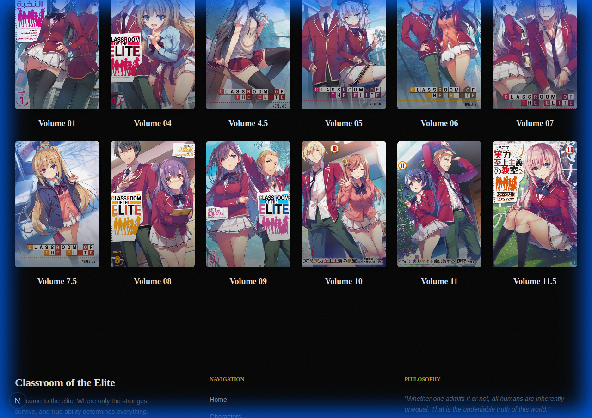

<p align="center">
  
</p>

<h1 align="center">Elite Classroom Showcase</h1>

<p align="center">
  <strong>A cinematic web experience that transforms storytelling into visual art.</strong>
</p>

<p align="center">
  <a href="#features">Features</a> •
  <a href="#tech-stack">Tech Stack</a> •
  <a href="#preview">Preview</a> •
  <a href="#installation">Installation</a> •
  <a href="#architecture">Architecture</a>
</p>

---

## Overview

A meticulously crafted web experience inspired by the psychological thriller *Classroom of the Elite*. This project demonstrates advanced frontend techniques typically reserved for award-winning digital experiences—scroll-driven animations, cinematic typography, and immersive visual storytelling.

Built as a showcase of modern web development capabilities, combining the performance of Next.js with the fluidity of GSAP animations and the precision of Tailwind CSS.

---

## Features

**Cinematic Hero Experience**  
Full-viewport hero section with layered parallax effects and atmospheric typography that sets the psychological tone immediately.

**GSAP Scroll Animations**  
Precisely choreographed scroll-triggered animations using GSAP ScrollTrigger. Elements reveal, transform, and respond to user interaction with frame-perfect timing.

**Character Gallery**  
Interactive character cards with Japanese typography, class designations, and smooth hover states. Each card reveals character details through elegant micro-interactions.

**Light Novel Archive**  
Complete volume collection with cover art, reading functionality, and download capabilities. Built with performance optimization for large media assets.

**Psychological Quote System**  
Rotating quote carousel featuring iconic series dialogue, complete with Japanese text overlays and attribution styling.

---

## Tech Stack

| Technology | Purpose |
|------------|---------|
| **Next.js 16** | React framework with App Router, server components, and optimized builds |
| **React 19** | Latest React features including concurrent rendering |
| **Tailwind CSS 4** | Utility-first styling with custom design tokens |
| **GSAP 3.14** | Professional-grade animation library with ScrollTrigger |
| **TypeScript** | Full type safety across the codebase |

---

## Preview

<details>
<summary><strong>Character Gallery</strong></summary>
<br>

</details>

<details>
<summary><strong>Quote Section</strong></summary>
<br>

</details>

<details>
<summary><strong>Volume Archive</strong></summary>
<br>

</details>

---

## Installation

```bash
# Clone the repository
git clone https://github.com/nouarmohamed/elite-classroom-showcase.git

# Navigate to project directory
cd elite-classroom-showcase

# Install dependencies
npm install

# Start development server
npm run dev
```

Open [http://localhost:3000](http://localhost:3000) to view the application.

### Build for Production

```bash
npm run build
npm start
```

---

## Architecture

```
├── app/
│   ├── page.tsx              # Landing page with hero, gallery, volumes
│   ├── layout.tsx            # Root layout with global styles
│   ├── volumes/              # Volume listing page
│   └── read/[year]/[volume]/ # Dynamic reading experience
├── components/
│   ├── Hero/                 # Hero section with parallax
│   ├── Characters/           # Character gallery components
│   ├── ui/                   # Shared UI components
│   └── layout/               # Layout components (Footer, etc.)
├── public/
│   ├── images/               # Character artwork
│   ├── covers/               # Volume cover images
│   └── volumes/              # PDF volumes
└── lib/                      # Utilities and helpers
```

---

## Performance

- **Image Optimization**: Next.js Image component with automatic WebP conversion
- **Code Splitting**: Dynamic imports for heavy components
- **Animation Performance**: GSAP with hardware-accelerated transforms
- **Font Loading**: Optimized web font loading with display swap

---

## Design Philosophy

This project treats web development as a visual medium. Every animation timing, every color choice, every typographic decision serves the narrative atmosphere. The goal isn't just functionality—it's creating a digital space that commands attention and demonstrates technical excellence.

The dark, cinematic aesthetic reflects the source material's psychological depth while showcasing modern CSS capabilities: glassmorphism, complex gradients, and precise micro-interactions.

---

## License

This project is created for educational and portfolio purposes.

---

<p align="center">
  <sub>Built with precision by <a href="https://github.com/nouarmohamed">Mohamed Nouar</a></sub>
</p>
